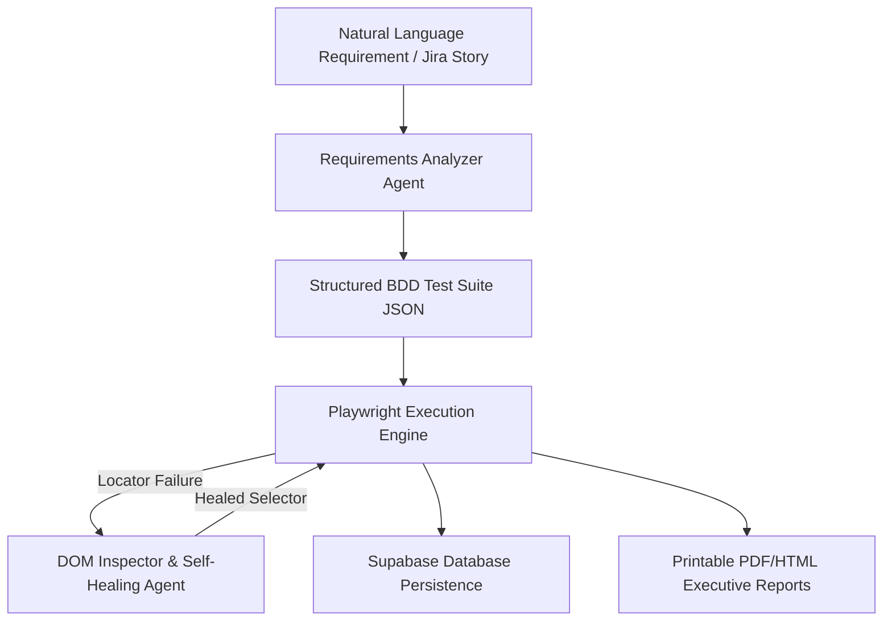

# AutoHealQA v1.0 🤖⚡
### Autonomous AI Test Automation & Real-Time Self-Healing Engine

[](https://github.com/Siddharth0317/AutoHealQA)
[](https://fastapi.tiangolo.com)
[](https://nextjs.org)
[](https://playwright.dev)
[](https://python.org)

**AutoHealQA** is an autonomous QA test generation and execution system. It parses plain English software requirements into structured Gherkin BDD test suites, executes them live across multi-browser and mobile device viewports using Playwright, and inspects broken CSS/XPath locators in real-time to repair them on-the-fly using LLMs.

---

## 🌟 Key Features

* **🤖 Natural Language Requirements Analyzer**: Converts raw user stories or Jira tickets into executable Gherkin BDD scenarios and step-by-step Playwright actions.
* **🩹 Real-Time Self-Healing Locator Engine**: When a Playwright locator fails due to UI updates or dynamic IDs, the engine extracts the DOM tree, inspects element hierarchies, and generates resilient fallback locators live during test execution.
* **👀 Live & Headless Execution Modes**: Watch browser automation open live windows on your desktop (`Headed`) or run ultra-fast in background mode (`Headless`).
* **🌐 Multi-Browser & Device Viewports**: Run test suites across Chromium, Firefox, WebKit (Safari), and mobile device presets (`iPhone 14`, `Pixel 7`).
* **📄 Printable Executive PDF Reports**: Download printable PDF/HTML test execution summary reports complete with step logs, duration metrics, and self-healing audit logs.
* **🔗 Jira & GitHub Webhook Integrations**: Auto-ingest Jira issues and GitHub Pull Request events to generate and run regression suites hands-free.
* **🔒 Admin Security Passcode**: Protected Admin Telemetry mode for system token consumption logs, latency auditing, and metrics.

---

## 🏗️ Architecture Overview



---

## 🚀 Quickstart Guide

### Prerequisites
* **Python 3.10+** (Python 3.14 fully supported)
* **Node.js 18+** & npm

### 1. Repository Clone & Environment Setup
```bash
git clone https://github.com/Siddharth0317/AutoHealQA.git
cd AutoHealQA
```

Create `.env` file in the root directory:
```env
HOST=0.0.0.0
BACKEND_PORT=8000
PORT=3000
ENVIRONMENT=development
ADMIN_PASSCODE=admin123
CORS_ORIGINS=http://localhost:3000,http://127.0.0.1:3000
```

### 2. Python Virtual Environment Setup
```bash
python -m venv .venv
.venv\Scripts\activate      # Windows
# source .venv/bin/activate # Linux/macOS

pip install -r requirements.txt
playwright install chromium firefox webkit
```

### 3. Frontend Next.js Installation
```bash
cd frontend
npm install
cd ..
```

---

## ⚙️ Running the Application

### Start FastAPI Backend (`Port 8000`)
```bash
.venv\Scripts\python.exe -m uvicorn backend.app.main:app --reload --port 8000
```

### Start Next.js Frontend (`Port 3000`)
```bash
cd frontend
npm run dev
```

Open your browser at **`http://localhost:3000`** to access the AutoHealQA Dashboard!

---

## 🧪 Running Automated Tests

Run the complete 11-part backend test suite:
```bash
.venv\Scripts\pytest.exe -v tests/
```

---

## 📄 License & Copyright

© 2026 **AutoHealQA**. Built with ❤️ by **sid.dev**. All Rights Reserved.
